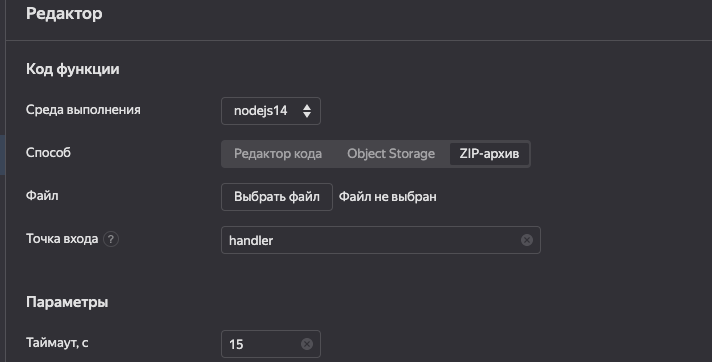

# Yandex cloud function-boilerplate

Boilerplate for fast deploy to Yandex Function.

`gulp` - creates zip package with source code.

`copy` this a lase package from `dist` folder in a yc console.

!
